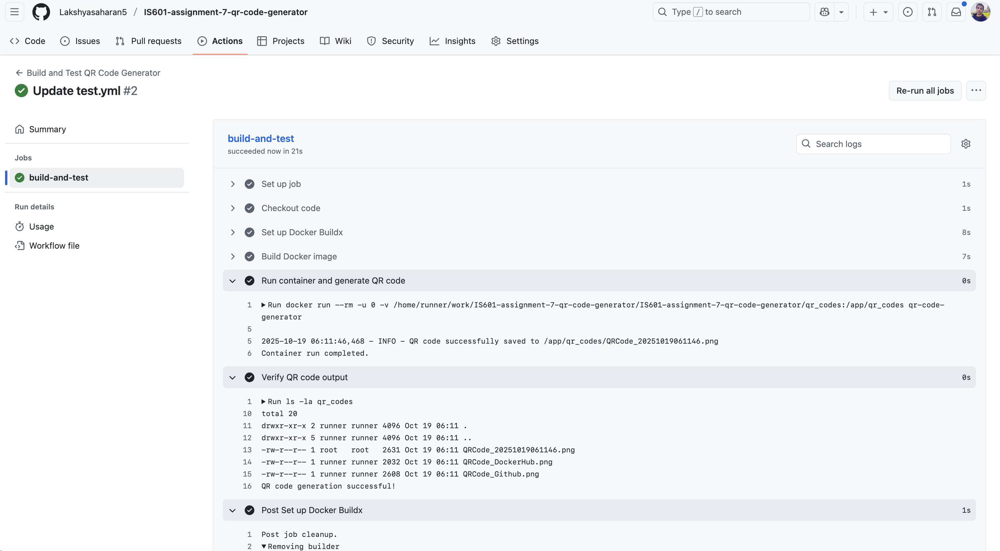
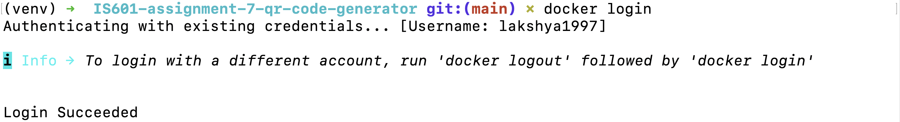
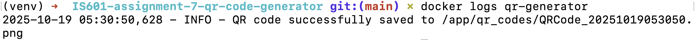
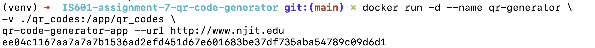
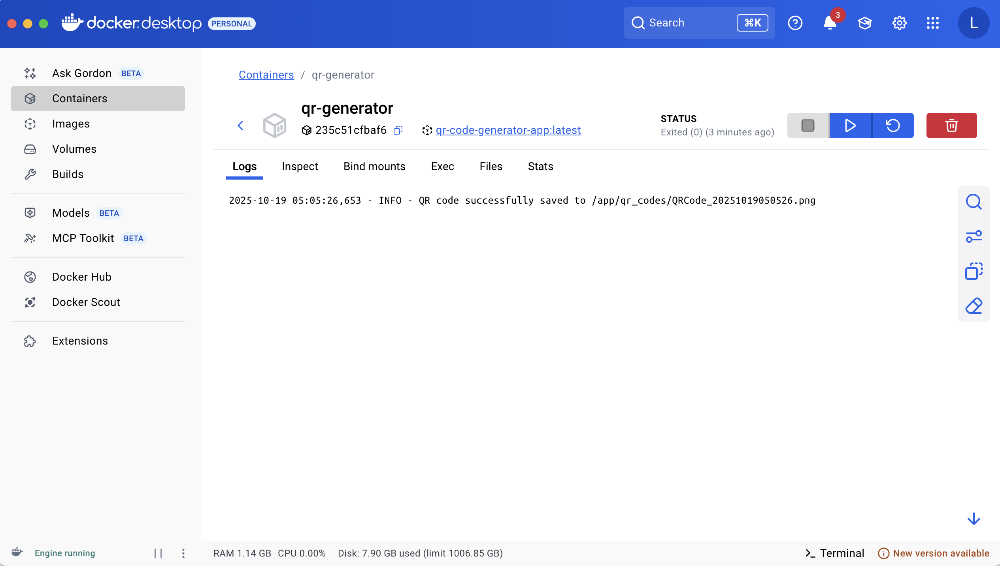
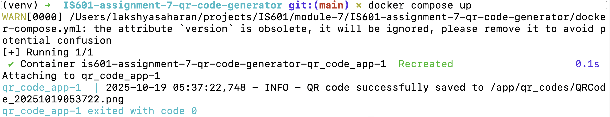
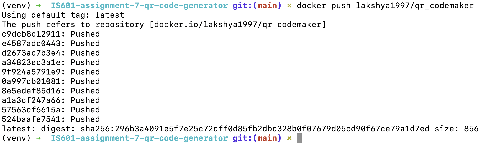

# IS601-assignment-7 QR Code Generator
QR code generator app in Docker container

### Github URL 

<a href="https://github.com/Lakshyasaharan5/IS601-assignment-7-qr-code-generator">https://github.com/Lakshyasaharan5/IS601-assignment-7-qr-code-generator</a>

### DockerHub Repo URL 

<a href="https://hub.docker.com/r/lakshya1997/qr_codemaker/tags">https://hub.docker.com/r/lakshya1997/qr_codemaker/tags</a>

## Assignment Screenshots

### Github Actions Workflow

### Docker login

### Docker log output

### Docker compose output

### Docker push image

